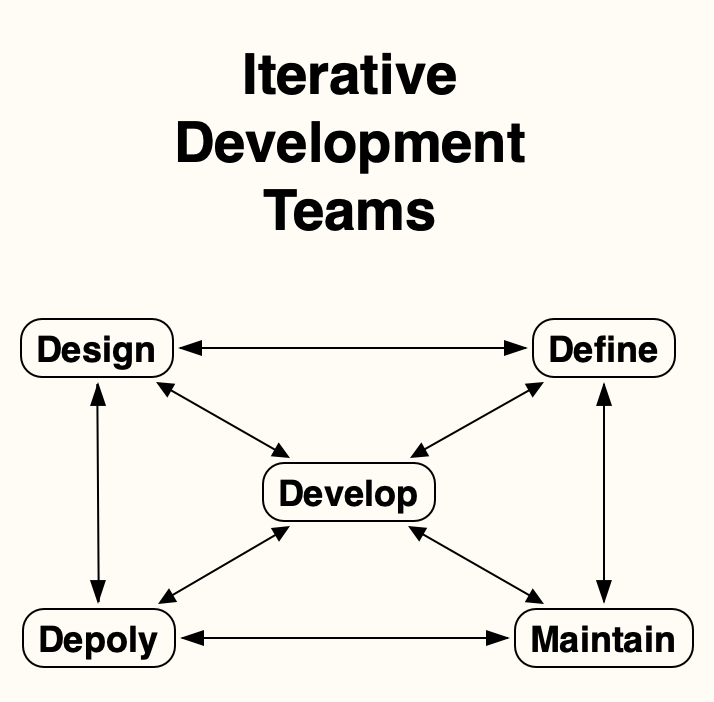

# Development Teams 

## Overview

Iterative website Define, Design, Develop, Deploy and Maintenance teams may be operational at the same time creating, testing, and helping with maintenance  

<!-- <figure markdown>
  {width="400"}

  <figcaption>Development Teams </figurecaption>
</figure>
Reaching a [Minimum Viable Product](../Support/minimum_viable_product.md) is the first Development teams goal -->

 
- [Team Define](team_define.md)   
  Defining websites helps the Iterative Development helps teams and Stakeholders understand the project.

- [Team Design](team_design.md)  
  Determines the core found
  ations of a user's website experience are:

- [Team Develop](team_develop.md)  
  Translates the Define and Design teams processes into website pages 

- [Team Deploy](team_deploy.md)  
  Deploys the website making it available on the Internet. The production version is deployed when Stakeholders agree.

- [Team Maintenance](team_maintenance.md)  
  Remediates the Define, Design, Develop, Deploy, or Security teams defects

<!-- ??? Warning "Defects"
	The slightest configuration, programming or security defect issues during the project will require Remediating and increasing overall lifetime costs  -->

## Define

Defining websites helps the Iterative Development teams and Stakeholders understand the project.

### Define - Prerequisites

Defining website prerequisites is the first steps in optimizing website costs

- Defining what the project is about

- Funding

- Purpose

- Functionality

- Stakeholders

- Content

- The **Must** and **Want** features

- Security requirements

## Design

Defining websites helps the Iterative Development teams and Stakeholders understand the project.

### Define - Prerequisites

Defining website prerequisites is the first steps in optimizing website costs

- Defining what the project is about

- Funding

- Purpose

- Functionality

- Stakeholders

- Content

- The **Must** and **Want** features

- Security requirements

## Develop

- Translates the Define and Design teams processes into website pages 

- Uses development languages to create website material such as text, graphics, and abstract logical structures. These languages are nonhuman, and strict 

- Configures and uses website development tools

### Develop - Prerequisites
- Decisions about resources required to transform the Define and Design work into a website and infrastructure

- Decisions about static site generator and programming tools
		

## Deploy

- Deploy websites making them available on the Internet. The production version is deployed when Stakeholders agree.

- Developers working on features, fixes, or testing may deploy a Private Preview website with their changes, without disturbing other developers work or the production version. This enables the Stakeholders to monitor progress. See Preview Deployments

### Deploy - Prerequisites

- Decisions about resources required for deploying production version of the website to the Internet

- Decisions about resources required for team developers working on features, fixes, or testing to deploy Private Preview Internet websites with their changes, for Stakeholders holders to view and give feedback, without disturbing other developers work or the production version

## Maintenance

- Maintain is remediating Define, Design,Develop, Deploy, or Security defects

- All teams may have members on the Maintain team to solve defects.

- Hot fixes are immediate fixes required for the production deployment.

- Problems requiring remediation are triaged. They are ranked from immediate Hot Fixes to those that are not show stoppers.
- The guardian and Stakeholders may choose to Rollback the production deployment to a previous production deployment if triage determines the remediation time is unacceptable.

- All fixes use the established fork, solution development, pull request processes, and version incrementing, including Hot Fixes.
  
### Maintenance - Prerequisites

- Decisions about remediating deployed websites

- Organizing members from other teams to be part of the Maintain team while remediating specific defects.
  
---

