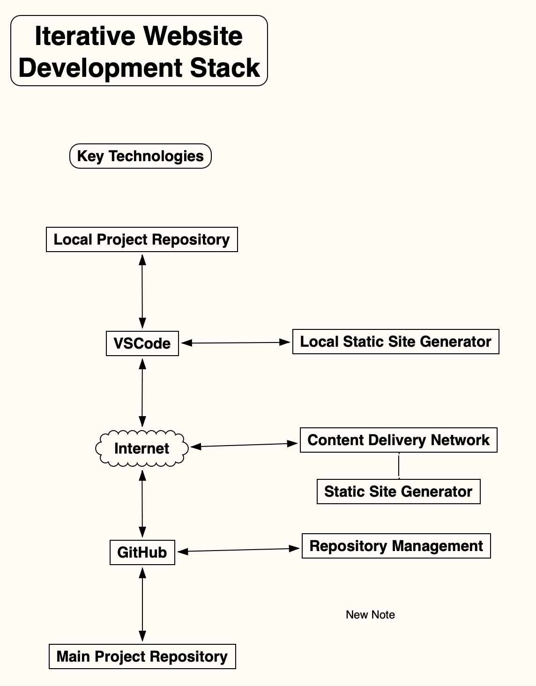

# Iterative Website Development <a id='iterative_dev_stack'></a>

``` {note}
  This is a **note**
  second line
```


 ```{abstract} "Purpose"
    The purpose of Iterative Website Development is to minimize website projects life time costs
```
<!-- <figure markdown>
  {width="800"}
  <figcaption>Iterative Website Development Stack</figurecaption>
</figure> -->


## **Key Technologies**

## **VSCode**

- Command and Control

- Text Editor

- Git / GitHub

- Command Line

## **Local Project Repository**

Developers creates a private copy of the Main Project Repository in their GitHub 
account using the `GitHub processfork` command.

Developer use `git commit` for changes to their private copy of the Main Project Repository

Developer changes can not be directly committed to the Main Project Repository. They use the `git pull` command to request the Repository Guardian add the changes to the Main Project Repository after review and testing.

## **Markdown**

Markdown is a lightweight markup language used to add formatting elements to plaintext text documents. 

Using Markdown is different than using a WYSIWYG editor. In an application like Microsoft Word, you click buttons to format words and phrases, and the changes are visible immediately. Markdown isn’t like that. When you create a Markdown-formatted file, you add Markdown syntax to the text to indicate which words and phrases should look different.

Markdown can be used for everything. People use it to create websites, documents, notes, books, presentations, email messages, and technical documentation.

Markdown is portable. Files containing Markdown-formatted text can be opened using virtually any application. If you decide you don’t like the Markdown application you’re currently using, you can import your Markdown files into another Markdown application. That’s in stark contrast to word processing applications like Microsoft Word that lock your content into a proprietary file format.

Markdown is platform independent. You can create Markdown-formatted text on any device running any operating system.

Markdown is future proof. Even if the application you’re using stops working at some point in the future, you’ll still be able to read your Markdown-formatted text using a text editing application. This is an important consideration when it comes to books, university theses, and other milestone documents that need to be preserved indefinitely.

Markdown is everywhere. Websites, GitHub support Markdown, and lots of desktop and web-based applications support it.

When you write in Markdown, the text is stored in a plaintext file that has an .md extension.

## **Local Static Site Generator**

// FIXME developer generating a private website for development and a private website for stakeholders

Developers use the `Local Static Generator` build a local website to see how edits would look  `program with a live website on. See edits as they happen.  MkDocs has it built in`

## **Content Delivery Network**

Create and deploys website using a Static Site Generator when notified by GitHub

The Repository Guardian create and deploy the main project website or a private website for stakeholders.

Developers create and deploys a private preview website for stakeholders

## **Main Project Repository**

Developers do not have direct access. They can clone it but not directly commit changes.

## **GitHub**

Notifies the `Content Delivery Network` when the developers Local Project Repository or Main Project Repository has been committed.

## **Repository Management**

The Repository Guardian and other team members evaluate and approve team members git pull requests central repository

The Repository Guardian requests Content Delivery Network to deploy private preview website for stakeholders.

The Repository Guardian requests Content Delivery Network to deploy a production website following the consensus of stakeholders

---

# **Development Example**

The Respiratory Guardian creates an initial Development Environment Respiratory. It contains
 the configured software development environment needed to create to the Production Website. 

The Respiratory Guardian creates the initial Main Project Respiratory. It contains the initial website file structure with basic things all developers will use with their copies, including a `git lock`  main branch.

Alice and Bob are developers. They each create a GitHub account. They both `git fork` the Development Environment Respiratory to their GitHub account. Then they then `git clone` their private copy of the Main Project Repository to their `GitHub` account. 

They create directories on their workstations for the Development Environment Respiratory and Main Project Respiratory. In both directories they install `git`

With the GitHub forked repositories URLs, they go to the Development Environment Respiratory and `git clone` it, then to the  

Each starts working on their software that will be may of the deployed Production Website.

Durning development Alice and Bob frequently `git commit` copies of their work to `GitHub`, and then create a local web version of their private copy of the Main Project Repository, using their web browser, they can see how it would look like on the web.

Every so often Alice and Bob using `git commit`, using a specific `git branch` to create a private Internet web site for stakeholders for feedback.

When Alice or Bod think their software is ready to be included in the Main Project Repository, they `git pull`

---


```python

```
